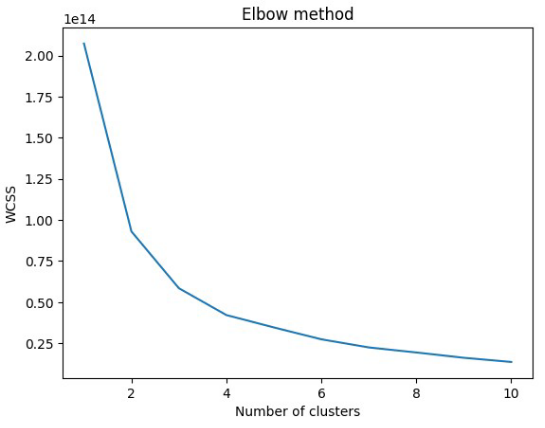

Feynn Labs Project-1

Market Analysis on EV market

Made by: Harshal Jagtap

0. Fermi Estimation

Fermi Estimation in short means breaking down a problem in small solvable parts which can be worked independently. Here in this market analysis (Electric Vehicle Market Analysis) the problem was broken in to following steps:

1. Collecting appropriate datasets.
1. Dividing type of datasets(behavioural, geographic, psychographic ).
1. Studying individual datasets.
1. Performing clustering on each datasets.
1. Profiling clusters.
1. Selecting suitable cluster.

1\. Data Sources

Data sources are various sources from which data is collected either in descriptive format or either in csv/xlsx file format. All the analysis is done on this data. Data Sources must be reliable the data must be verified and must be real world data and not made up data.

1. data.gov.in
1. parivahan.gov.in
1. kaggle
1. github

2\. Data Pre-processing

In this step the data collected from various sources is first monitored and in case if data is not clean, it must be processed for it to be used in further analysis.

Following libraries are used for data preprocessing:

1. Pandas
1. Numpy
1. Matplotlib
1. Seaborn
1. Sklearn

All the descriptive, non descriptive data is first processed then with the help of libraries used to visual representation (matplotlib, seaborn), data is plotted in graphs like bar graph, countgraph, violinplot for the user/client to understand and analyse data properly and easily.

3. Segment Extraction

In Segment Extraction the data is passed through an algorithm, in which case here it was Kmeans algorithm. After choosing the appropriate number of clusters, the data is clustered into specific clusters/segments.

By using elbow method, it was observed that 4 are optimal number of clusters to be made.

4. Profiling and describing potential segments

The four clusters formed are:

1. cluster\_0
1. cluster\_1
1. cluster\_2
1. cluster\_3

CLUSTER\_0

Total number of customers in cluster\_0: 38

Mean values of descriptive data columns for all the data points in cluster\_0 are:

Age - Mean:  32.026315789473685

No of Dependents - Mean:  1.8157894736842106 Salary - Mean:  1178947.3684210526

Wife Salary - Mean:  160526.31578947368

Total Salary - Mean:  1339473.6842105263 Price - Mean:  852894.7368421053

CLUSTER\_1

Total number of customers in cluster\_1: 26

Mean values of descriptive data columns for all the data points in cluster\_1 are:

Age - Mean:  35.61538461538461

No of Dependents - Mean:  2.1538461538461537 Salary - Mean:  1557692.3076923077

Wife Salary - Mean:  884615.3846153846

Total Salary - Mean:  2442307.6923076925 Price - Mean:  1388461.5384615385

CLUSTER\_2

Total number of customers in cluster\_2: 15

Mean values of descriptive data columns for all the data points in cluster\_2 are:

Age - Mean:  42.2

No of Dependents - Mean:  2.533333333333333 Salary - Mean:  2653333.3333333335

Wife Salary - Mean:  1586666.6666666667 Total Salary - Mean:  4240000.0

Price - Mean:  1740000.0

CLUSTER\_3

Total number of customers in cluster\_3: 20

Mean values of descriptive data columns for all the data points in cluster\_3 are:

Age - Mean:  40.95

No of Dependents - Mean:  2.65 Salary - Mean:  2340000.0 Wife Salary - Mean:  0.0

Total Salary - Mean:  2340000.0 Price - Mean:  1180000.0

8\. Optimal market segments

From the above observation it would be beneficial for the EV company to target the customers falling under the characteristics of cluster 0 and cluster 1.

Following are the states to be targeted as these states have the highest number of EV charging stations in India:

1. Maharashtra
1. Andra Pradesh
1. Tamil Nadu
1. Gujarat
1. Uttar Pradesh
1. Rajasthan

Following are the highways to be targeted as these highways haveing the highest number of EV charging stations in India. So any person using this route may be a potential customer:

1. Mumbai - Delhi Highway
1. Kolkata- Nagpur
1. Chennai- Nagpur
1. Mumbai - Bengaluru Highway

9\. Github

Harshal Jagtap https://github.com/harshaljagtap6/ev\_market\_segmentaion
